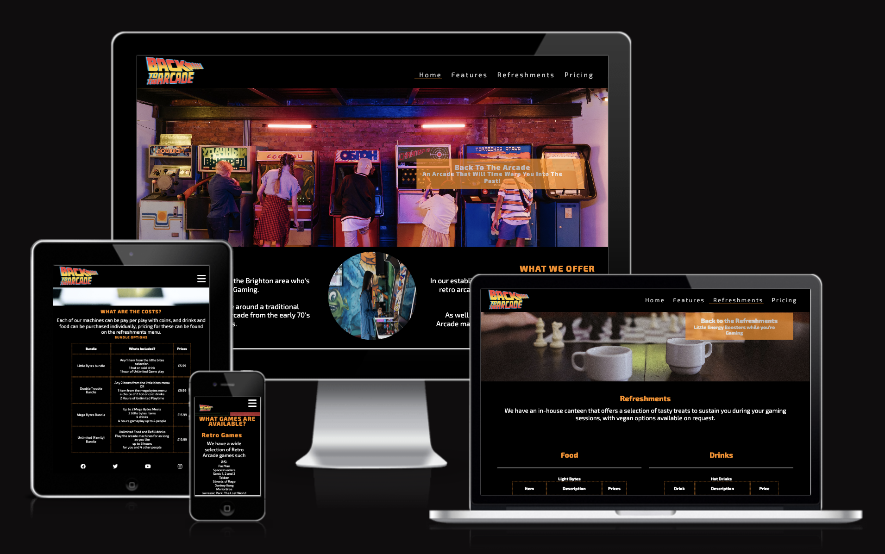

# Back-to-the-arcade
Code Institute Portfolio Project 01

---

## Site Overview
Back To The Arcade is the website for a fictional Business that would be located in Brighton, England. The aim of the Arcade is to bring back the nostalgic feel of classic 80’s arcades when video games were in their infancy.

The Arcade aims to bring Retro games into the modern world and share the joy of these classic machines and games while also allowing for current console games and table top gaming all to be enjoyed in one place. 
  

# Table of Contents
1. [Site Overview](#site-overview)  
2. [Planning Stage](#planning-stage)
    * [Target Audience](#target-audience)
    * [User Stories](#user-stories)
    * [Site Aims](#site-aims)
    * [Color Scheme](#color-scheme)
    * [Typography](#typograpy)   
3. [Current Features](#current-features)
    * [Header Element:](#header-element)
    * [The Site Features](#the-site-features)
    * [Footer](#footer)
4. [Future Enhancements](#future-enhancements)
5. [Testing Phase](#testing-phase)
6. [Deployment](#deployment)
7. [Tech](#tech)
8. [Credits](#credits)
    * [Honorable Mentions](#honerable-mentions)
    * [General Reference](#general-reference)
    * [Content](#content)
    * [Media](#media)

## Planning Stage

### target Audience
The target audience for back to the Arcade are people that enjoy gaming of all eras.
* People interested in the nostalgic effect of retro gaming
* People that enjoy going to arcades
* People who like the atmosphere of piers and arcades and want food, refreshments and a top notch gaming experience all in one place
* People interested in family friendly activities in the Brighton area

### User Stories
During the reaserch phase, users of retro arcades had the following they wanted to see in this arcade:
* A user said they wanted somewhere to play classic games with a friendly atmosphere
* A user said they wanted an authentic gaming experience with the ability to eat good food while playing
* A user wanted a family friendly place where they can teach their children about the golden age of gaming

### Site Aims
The site aims to provide information to people in the brighton area about the arcade in an easy to use format with all possible questions answered in one place by:
* Informing the user who we are and what we offer
* Providing the user with the prices of all the items in one place
* Giving users the information they need on how to find the arcade

### Color Scheme
The site uses a color scheme to compliment the Logo image. The primary colors used are:
* black #000 
* Dark Orange
* White

### Typograpy
This website solely uses the Exo 2 font as it fits in with the theme of the logo font and has a retro game feel to it.  
The font was taken from Google Fonts as described in the credits section.

## Current Features Common to all pages
Across the site I have used the same styles for each of the web pages so they are easy to follow and the code is readable.

### Header Element:
 * The Header encorporates a logo image that takes up the same amount of the screen across devices.
 * There is a Navigation bar with working links across all devices, it has different sizes and styles depending on the size of the device:
      * On Mobile devices such as smart phones, the nav bar shows as a burger menu icon with a dropdown toggle.
      * On larger portable devices such as Tablets, the Navigation bar is still hidden in a burger style dropdown toggle menu.
      * On Laptops and Desktops the Navigation links span across the top-right of the screen and the Logo is fixed to the left of the screen.

### The Site Features: 
 * Each page of the website follows the same basic structure with a Hero image followed by 1 or more sections.
 * Each hero image has a cover text element and these all follow the same design structure as this provides consistancy above the whole site.
 * The index and Features pages both employ the same design style with a center image surrounded by text, note that for responsiveness this image only appears on larger devices, while on smaller devices the text stacks on top of each other.
 * The tables on the pricing and refreshments pages are laid out consistantly with the design of the website by:   
    * Using the same dark orange coloring for the borders as the cover image text.
    * being consistent in size and spacing to allow for full content to be viewable on mobile devices while not looking crampt on larger screens.

### Footer
The footer element is designed to be responsive and spans across the bottom of the page across all screen sizes without taking up too much room.
 * The social network icons are evenly spaced across the footer and all open as new tabs rather than the current tab, this improves accessibility.

## Future Enhancements
 * A Sign-up page to inform potential customers about the arcades latest updates
 * The option for potential customers to book their visit online
 * There is potential to add javascript to make the web page interactive 

## Testing Phase
During the Testing Phase I relied heavely on Google Developer Tools which allowed me to test the responsiveness and layouts across multiple screen sizes. 
   * With the GitHub Mobile app I was able to continuously test the layout of each page and feature on My iPhone 14 pro, as well as my iPad Air 4th Gen.
   * I was able to test the layout on a MacBook Air as well as a larger monitor which all helped me see any bugs and issues in real time.
Once I was happy that the project had all the desired content I was able to run the working url through some validators with the following results: -

## Deployment
As I needed to text the website on multiple devices with different screen sizes, I deployed the website very early in the development proce. To achieve this I depoloyed the site using GitHub pages where I performed the following steps: -
   1. In the projects repository I clicked on the *Settings* tab.
   2. I then selected the Pages tab in the menu on the left.
   3. In the Source section, I Selected the Main branch of my repository from the dropdown menu, then clicked Save.
   4. A Message was displayed that confirmed successful deployment to GitHub pages and this provided a live link. The live website can be found via the following URL - https://leighallendev.github.io/Back-to-the-arcade/

## Tech
As per the Code Institute project guidlines, this website is entirely built using the following technologies:
  * HTML
  * CSS

## Credits

### Honerable Mentions

### General Reference

### Content

### Media

[def]: assets/images/AmIResponsive.png
